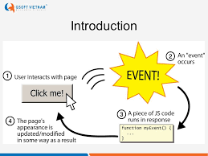
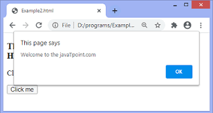

# Lecture6-April
# Homework-DOM
## _DOM_


### According to the Document Object Model (DOM), every HTML tag is an object. Nested tags are “children” of the enclosing one. The text inside a tag is an object as well.

---------------------------------------------------------------------------


## _`querySelector()`_
### The querySelector() method returns the first child element that matches a specified CSS selector(s) of an element, querySelectorAll() method can be used to access all elements which match with a specified CSS selector.


## _`innerHTML`_
### `innerHTML` - Это свойство предоставляет простой способ полностьюзаменить содержимое элемента. Например, все содержимое элемента body может быть удалено:


## _`createElement()`_
### The JavaScript document.createElement() method allows you to create and return a new element (an empty Element node) with the specified tag name.
```
<!DOCTYPE html>
<html lang="en-US">
  <head>
    <meta charset="UTF-8" />
    <title>Working with elements</title>
  </head>
  <body>
    <div id="div1">The text above has been created dynamically.</div>
  </body>
</html>
```


```
document.body.onload = addElement;

function addElement() {
  // create a new div element
  const newDiv = document.createElement("div");

  // and give it some content
  const newContent = document.createTextNode("Hi there and greetings!");

  // add the text node to the newly created div
  newDiv.appendChild(newContent);

  // add the newly created element and its content into the DOM
  const currentDiv = document.getElementById("div1");
  document.body.insertBefore(newDiv, currentDiv);
}
```

##  _`appendChild()`_
### The appendChild() method appends a node (element) as the last child of an element.
```
const node = document.createElement("li");
const textnode = document.createTextNode("Water");
node.appendChild(textnode);
document.getElementById("myList").appendChild(node);
```


## _Document.getElementById(id)_
.png)
### If an element has the id  attribute, we can get the  element using the method document.getElementById(id), no matter where it is.
----------------------------------------------------------------------------
## _Events_

### JavaScript's interaction with HTML is handled through events that occur when the user or the browser manipulates a page.

### When the page loads, it is called an event. When the user clicks a button, that click too is an event. Other examples include events like pressing any key, closing a window, resizing a window, etc.
-----------------------------------------------------------------------------
##  _Onclick()_

### The onclick event occurs when the user clicks on an HTML element.
